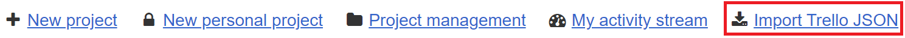
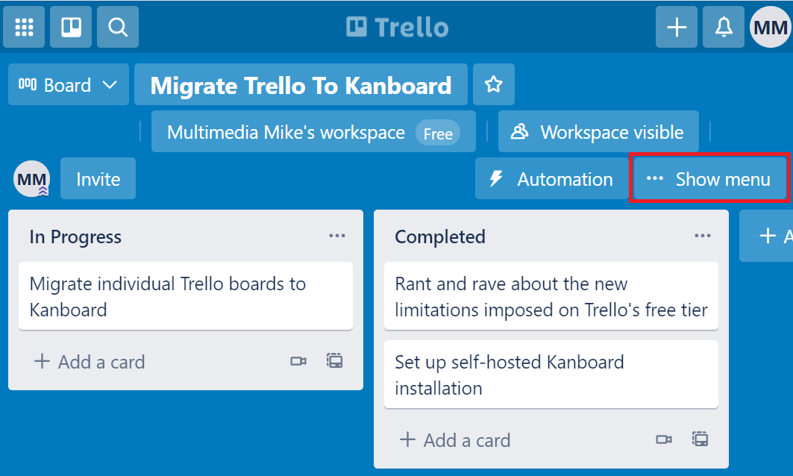
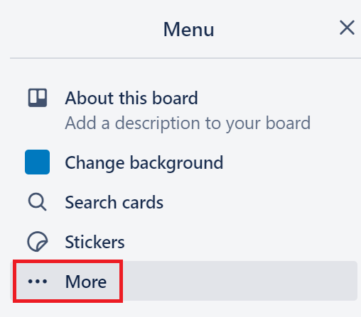
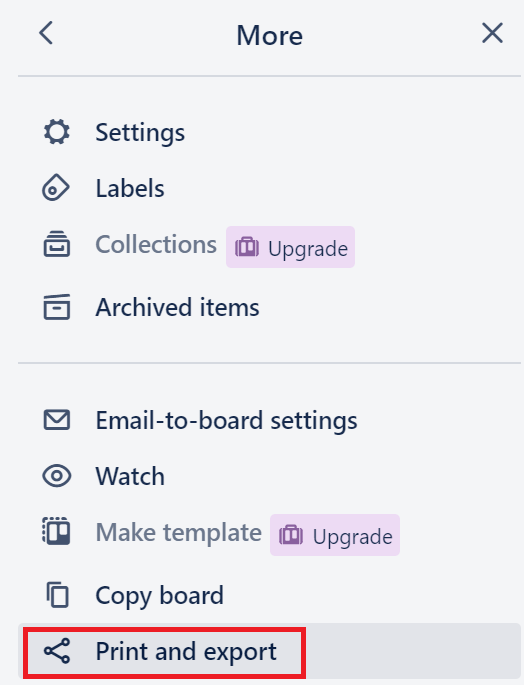
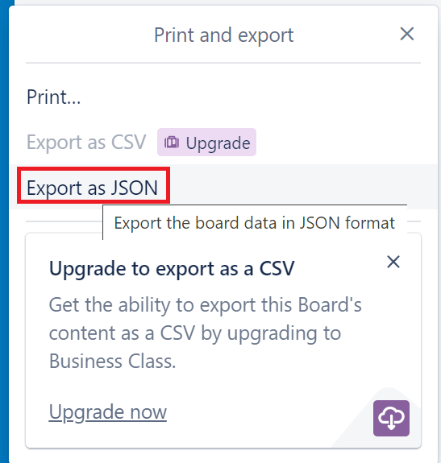
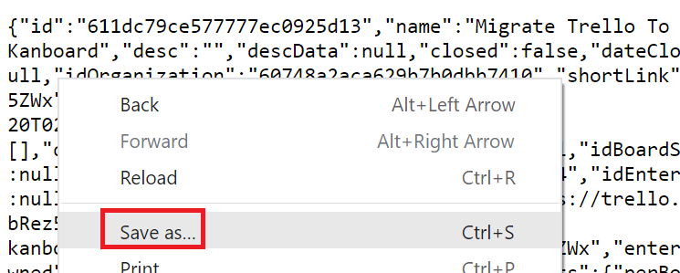

TrelloJSON2Kanboard
==============================

Plugin for Importing Trello Projects from JSON Files to Kanboard.

Donate to help keep this project maintained.

Author
------

- Wilton Rodrigues
- License MIT

Requirements
------------

- Kanboard >= 1.0.35
- PHP curl Extension

Installation
------------

You have the choice between 2 methods:

1. Download the zip file and decompress everything under the directory `plugins/TrelloJSON2Kanboard`
2. Clone this repository into the folder `plugins/TrelloJSON2Kanboard`

Note: Plugin folder is case-sensitive.

When the plugin is installed, the option "Import Trello JSON" appears on the top menu of the main Kanboard dashboard:

Exporting JSON Data From Trello
-------------------------------

Each Trello board needs to be exported individually. These screenshots illustrate the process (this reflects the Trello web UI as of August, 2021).

First, open a board and click the "... Show menu" button:

On the menu, expand the "... More" option:

Select the option to "Print and export":

From the "Print and export" menu, select the option to "Export as JSON":

This will deliver a raw JSON dump via the web browser. Right click in the browser and select "Save as..." in order to download from a file:

After downloading this JSON file, use the new "Import Trello JSON" option on the main Kanboard dashboard to import the Trello board.
